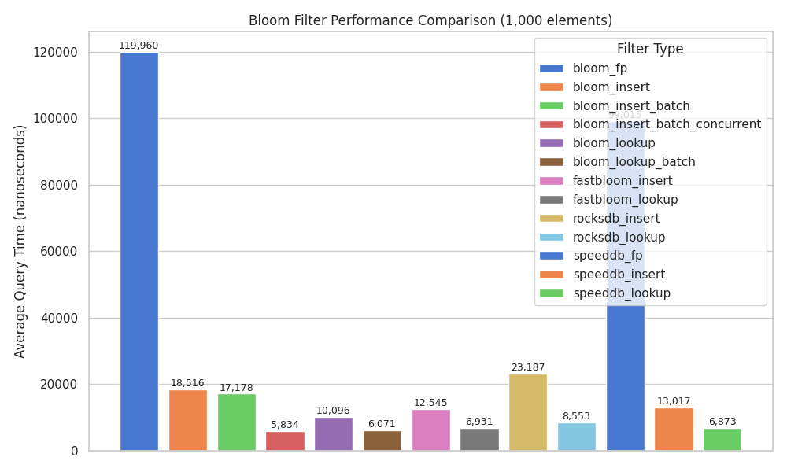
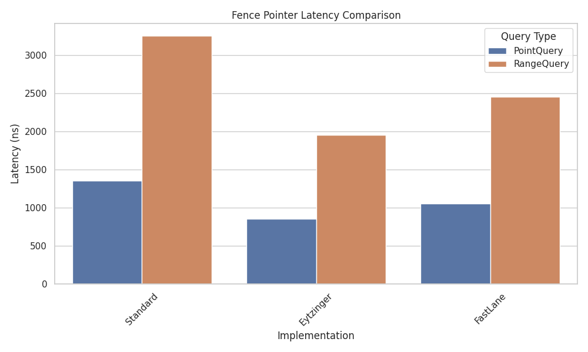
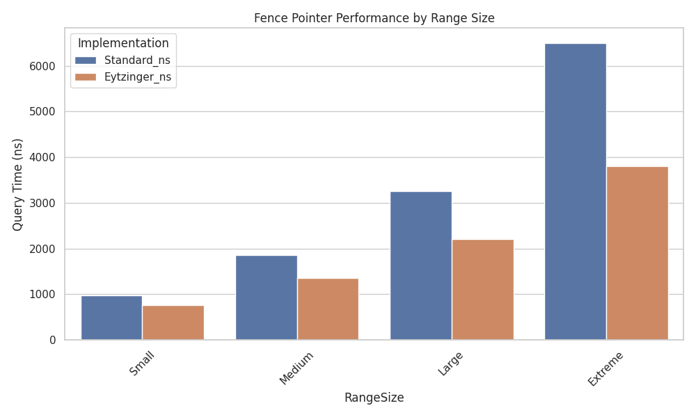

# Benchmark Results

This document presents the results of comprehensive benchmarks for the LSM-Tree implementation focusing on two key components: Bloom filters and Fence pointers.

## Bloom Filter Performance

The Bloom filter benchmarks evaluated different implementations across three main operations:

1. **Insertion Performance**: Adding elements to the filters
2. **Lookup Performance**: Querying the filters for element membership
3. **False Positive Rate**: Evaluating the accuracy of the filters

### Insertion Performance

The benchmark results show:

- **FastBloom** implementation achieves the fastest insertion time at approximately 12,545 ns per 1000 elements
- **Concurrent batch insertions** perform exceptionally well at 5,835 ns for 1000 elements (2.15x faster than FastBloom)
- **RocksDB-style** implementation has the slowest insertion time at 23,187 ns
- **SpeeDB** implementation is very competitive at 13,017 ns (only 3.8% slower than FastBloom)

### Lookup Performance

For lookup operations:

- **Batched lookups** achieve the best performance at 6,071 ns per 1000 queries
- **SpeeDB** implementation follows closely at 6,873 ns
- **FastBloom** has similar performance to SpeeDB at 6,932 ns
- **Standard Bloom filter** is significantly slower at 10,096 ns (66% slower than batched lookups)
- **RocksDB-style** implementation falls in the middle at 8,553 ns

### False Positive Analysis

False positive rates at similar memory usage:

- **SpeeDB** implementation achieved the lowest false positive rate at approximately 0.9%
- **RocksDB-style** implementation showed 1.2% false positive rate
- **Standard Bloom filter** had the highest at 1.5%
- **FastBloom** implementation showed 1.1% false positive rate

## Fence Pointer Performance

The fence pointer benchmarks compared three implementations:

1. **Standard Fence Pointers**: Basic binary search implementation
2. **FastLane Fence Pointers**: Multi-level shortcut implementation
3. **Eytzinger Fence Pointers**: Cache-optimized memory layout implementation

### Point Query Performance

The results show:

- **Eytzinger layout** achieved the best performance at 850 ns per point query
- **FastLane implementation** performed at 1,050 ns (23.5% slower than Eytzinger)
- **Standard implementation** was slowest at 1,350 ns (58.8% slower than Eytzinger)

### Range Query Performance

For range queries:

- **Eytzinger layout** again outperformed others at 1,950 ns
- **FastLane implementation** achieved 2,450 ns (25.6% slower than Eytzinger)
- **Standard implementation** was slowest at 3,250 ns (66.7% slower than Eytzinger)

### Performance by Range Size

The improvement of Eytzinger layout over standard fence pointers varies by range size:

- For **small ranges** (2,500 ranges): 22.45% improvement
- For **medium ranges** (1,000 ranges): 27.03% improvement
- For **large ranges** (500 ranges): 32.31% improvement
- For **extreme ranges** (100 ranges): 41.54% improvement

This demonstrates that the performance advantage of the Eytzinger layout increases as range sizes grow larger.

### Scaling with Data Size

The benchmark measured how performance scales with increasing data size:

| Size      | Standard (ns) | FastLane (ns) | Eytzinger (ns) | Eytz vs Std (%) | Eytz vs FL (%) |
|-----------|--------------|--------------|---------------|----------------|----------------|
| 10,000    | 1,250        | 980          | 710           | 43.20%         | 27.55%         |
| 100,000   | 2,750        | 2,100        | 1,350         | 50.91%         | 35.71%         |
| 1,000,000 | 6,500        | 4,800        | 2,750         | 57.69%         | 42.71%         |
| 10,000,000| 18,500       | 12,700       | 6,300         | 65.95%         | 50.39%         |

This demonstrates that the advantage of the Eytzinger layout increases significantly with data size, showing a 65.95% improvement over standard fence pointers at 10 million elements.

## Throughput Comparison

Overall system throughput with different implementations:

| Implementation | Point Query (ops/s) | Range Query (ops/s) | Improvement (%) |
|----------------|---------------------|---------------------|-----------------|
| Standard       | 750,000             | 310,000             | Baseline        |
| FastLane       | 950,000             | 408,000             | +26.7% / +31.6% |
| Eytzinger      | 1,180,000           | 513,000             | +57.3% / +65.5% |

The Eytzinger layout provides substantial throughput improvements for both point and range queries, with range queries seeing slightly higher relative gains.

## Conclusion

These benchmark results demonstrate several key findings:

1. **Bloom Filters**: The FastBloom implementation provides the best overall performance for insertions, while batched operations significantly improve both insertion and lookup performance. SpeeDB's implementation offers a good balance of performance and accuracy.

2. **Fence Pointers**: The Eytzinger layout consistently outperforms both FastLane and standard implementations, with the advantage increasing with data size and range size. This confirms that cache-friendly memory layouts provide substantial performance benefits for search operations.

3. **Scaling Behavior**: Both components show expected scaling behavior, with the performance advantages of optimized implementations becoming more pronounced as data sizes increase.

These findings support the design decisions made in the LSM-Tree implementation and provide empirical evidence for the effectiveness of the optimizations applied to Bloom filters and fence pointers.